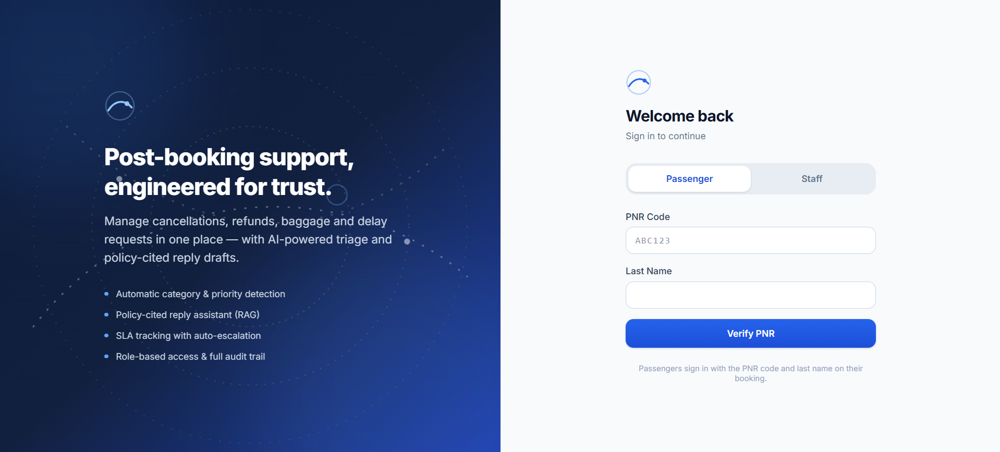
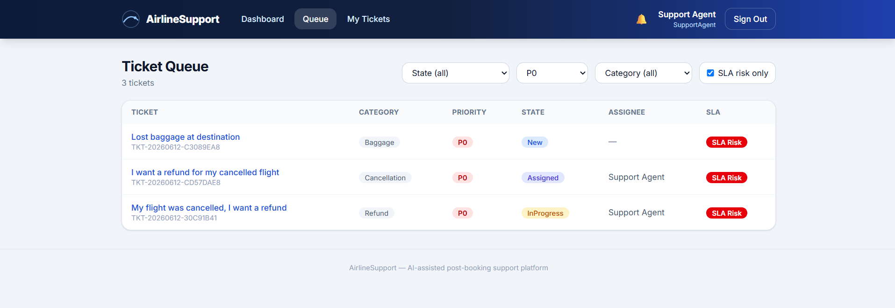
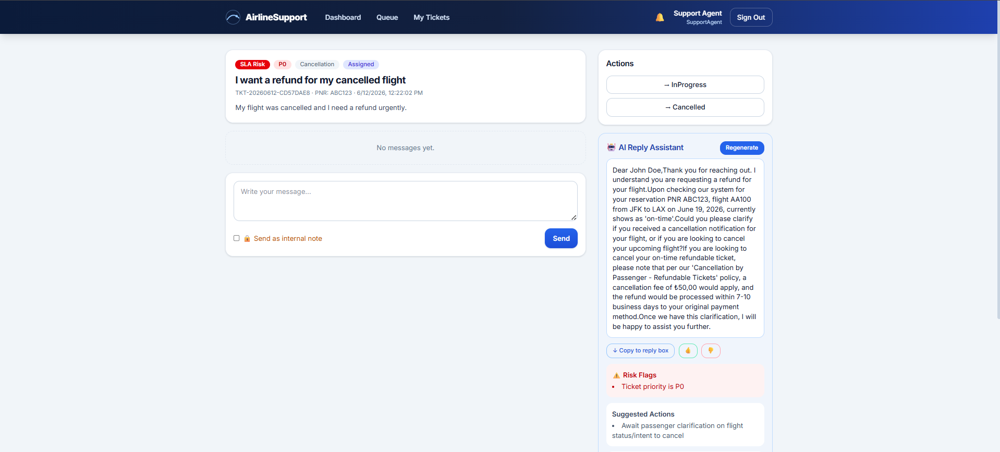
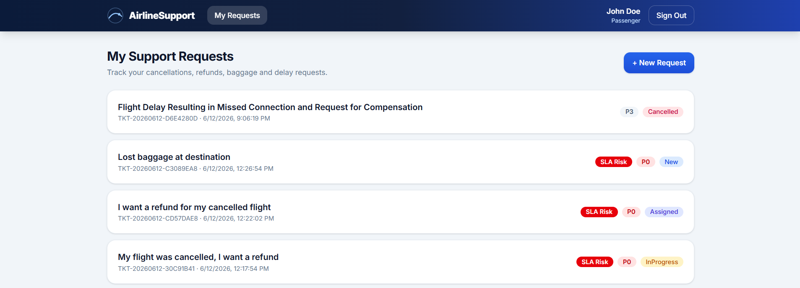
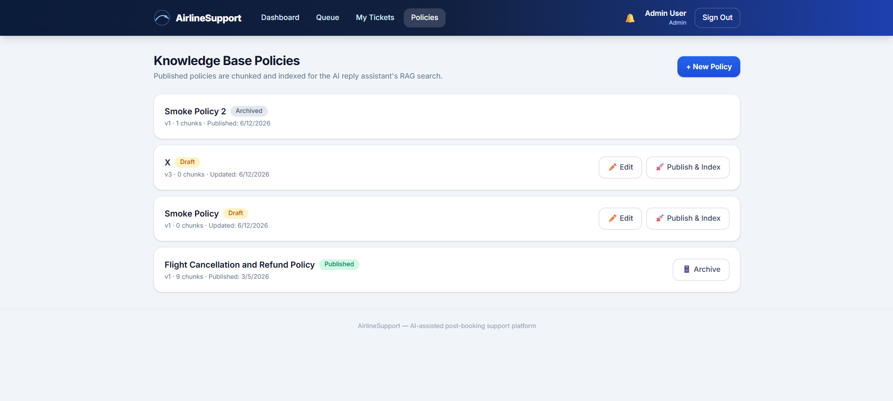
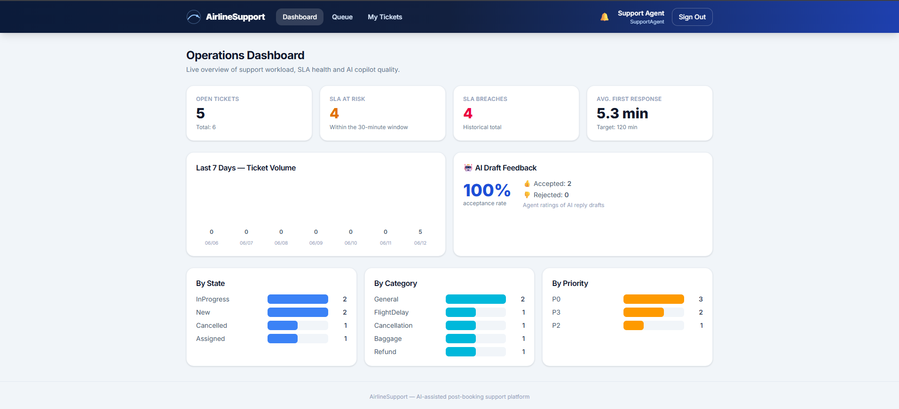
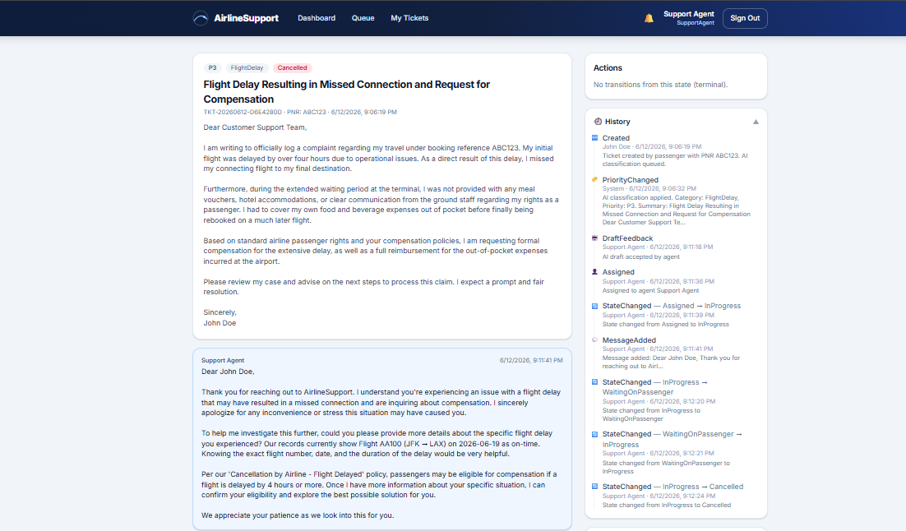

# Skydesk ✈ AI-Assisted Airline Support Platform

> Full-stack, production-grade support ticketing for post-booking airline operations —
> AI triage, RAG-cited reply drafting, SLA automation.


> 📐 Design rationale and ADRs: see [ARCHITECTURE.md](ARCHITECTURE.md)

A production-grade, full-stack support platform for post-booking airline customer service. Passengers verify with their PNR, open tickets for cancellations/refunds/baggage issues, and support agents work an SLA-tracked queue with an **AI copilot** (Google Gemini) that classifies tickets and drafts policy-cited replies via RAG.

**Backend:** ASP.NET Core 8 · Clean Architecture · DDD · CQRS · EF Core · SQL Server
**Frontend:** React 19 · TypeScript · Vite · Tailwind CSS v4 · TanStack Query
**AI:** Google Gemini (gemini-2.0-flash + text-embedding-004) with automatic mock fallback

---

## 📸 Screenshots

> _Add screenshots to `docs/screenshots/` and they will render below._

| Login | Agent Queue |
|---|---|
|  |  |

| Ticket Detail + AI Copilot | Passenger Portal |
|---|---|
|  |  |

| Admin Policy Management |  |
|---|---|
|  |

| Operations Dashboard | Audit Timeline |
|---|---|
|  |  |

---

## ✨ Features

### 🔐 Authentication & Security
- **JWT Bearer auth** with role-based access (Passenger / SupportAgent / Admin)
- **PNR verification with provisioning** — passengers verify with PNR + last name; a real user account is provisioned on first verification so ownership, authorization, and audit always use real identities (no shared/anonymous identity)
- **Rotating refresh tokens** — single-use, SHA-256 hashed at rest, revocable (`/api/auth/refresh`, `/api/auth/logout`); frontend silently refreshes expired access tokens
- **Account lockout** — 5 failed logins → 15-minute lock
- **Rate limiting** — 5 req/min per IP on auth endpoints (brute-force protection), 100 req/min global
- **IDOR protection** — passengers can never read or write other passengers' tickets; cross-access returns 404 so existence isn't leaked
- **PNR ownership check** — tickets can only be opened for the reservation the passenger verified
- **PBKDF2-SHA256** password hashing (600k iterations, timing-safe comparison)

### 🤖 AI Copilot (Google Gemini)
- **Outbox-backed async classification** — tickets are created instantly with safe defaults; the classification job is written to a **DB outbox in the same transaction** (survives restarts), and a polling worker calls Gemini with timeout + bounded retries, recording failures per row. A late AI result never overrides an agent's triage decision
- **Hybrid RAG retrieval** — token-budgeted chunking with overlap (`MarkdownChunker`), then query-time ranking that blends **semantic similarity (0.7) with keyword relevance (0.3)** so paraphrases and exact terminology both hit
- **Retrieval evaluation suite** — a golden question set asserts **recall@5 ≥ 80%** in CI, so chunking/scoring regressions are caught before they ship
- **Draft-reply with citations** — full thread context + reservation details + retrieved policy chunks → reply draft with **policy citations, risk flags, and next actions**
- **Deterministic output safety layer** — `DraftSafetyInspector` re-checks every draft for specific monetary promises and internal-note leakage, surfacing findings as risk flags (warn, never block)
- **Feedback loop** — agents rate drafts 👍/👎; the acceptance rate is tracked on the dashboard. Every AI call is logged with model, duration, and outcome, and wrapped in an OpenTelemetry span
- **Prompt-injection hardening** — passenger content is delimited and treated as data; AI output is enum-validated
- **Graceful degradation** — no API key → keyword-based mock mode; API failure → fallback logic. The app never depends on AI availability

### 🎫 Ticket Lifecycle
- **Strict state machine**: `New → Triaged → Assigned → InProgress → WaitingOnPassenger → Resolved → Closed` (+ `Cancelled`, + reopen). Invalid transitions → **409 Conflict**
- **Optimistic concurrency** — `RowVersion` on tickets; conflicting agent updates → 409
- **Internal notes** invisible to passengers (enforced server-side, not just UI)
- **Append-only audit trail** — every action recorded with actor, before/after state

### ⏱️ SLA Engine
- First-response SLA (2h) and resolution SLA (24h) tracked per ticket
- **SLA risk computed at query time** — never stale, filterable in the agent queue
- Background monitor escalates priority on breach (idempotent — audit-event guarded), notifies the assigned agent, and auto-closes tickets 72h after resolution

### 📚 Knowledge Base (RAG)
- Full policy lifecycle: **draft → edit (versioned) → publish → archive**; archived policies automatically drop out of retrieval
- Publishing chunks documents by headings with token budgets + overlap and indexes embeddings
- Embedding vectors cached in-memory, invalidated on reindex

### 🛠️ Operations & Observability
- **RFC 7807 ProblemDetails** everywhere (validation errors included)
- **Serilog** structured logging + request logging + **correlation IDs**, with an optional **Seq** sink (ships in docker-compose at `:8081`)
- **OpenTelemetry tracing** — request spans, outbound HTTP, and custom `Skydesk.AI` spans around every Gemini call
- **Append-only audit trail** exposed via `GET /api/tickets/{id}/audit` and rendered as a timeline in the agent UI
- **Operations dashboard** — open tickets, SLA risk/breach counts, average first response, category/priority/state distributions, 7-day volume, AI draft acceptance rate
- **Health checks** (`/health` with DB probe), CORS, **API versioning** (v1 default; `X-Api-Version` header)
- **ForwardedHeaders** — correct client IPs behind a reverse proxy; **EF connection resiliency** (`EnableRetryOnFailure`)
- **Docker** (multi-stage builds for API and frontend + Nginx + SQL Server + Seq) and **GitHub Actions CI** (backend build+test, frontend test+type-check+build)

### 💻 Frontend
- Split-screen login (passenger PNR / staff credentials)
- **Passenger portal** — ticket list with status/priority/SLA badges, creation form, message threads
- **Agent workspace** — operations dashboard, filterable queue (state/priority/category/SLA risk, pagination, 30s auto-refresh), ticket detail with state-machine-aware transition buttons, assign-to-me, internal notes, **audit timeline**, **AI draft panel** (generate → review risks/citations → 👍/👎 feedback → copy into reply box), notification bell with unread badge
- **Admin** — full policy lifecycle UI (create/edit Markdown drafts, publish & index for RAG, archive)
- Skeleton loaders, empty states, ProblemDetails-aware error banners, silent token refresh
- **Vitest + Testing Library** suite (17 tests: API client refresh flow, claim parsing, state-machine mirror, components)

---

## 🏗️ Architecture

```
┌────────────────┐     ┌──────────────────────────────────────────────┐
│ React Frontend │────▶│ Support.Api          (controllers, filters)  │
│ (Vite + TS)    │     │   └─ Support.Application (CQRS handlers)     │
└────────────────┘     │       └─ Support.Domain   (entities, rules)  │
                       │   Support.Infrastructure (EF, Gemini, jobs)  │
                       └──────────┬───────────────────┬───────────────┘
                                  │                   │
                          SQL Server (EF Core)   Google Gemini API
                                  ▲                   ▲
                 Background: ClassificationWorker · SlaMonitorService
```

- **Domain** has zero dependencies; entities use private setters and enforce invariants internally
- **Application** holds use-case handlers (manual CQRS, auto-registered via assembly scan) returning `Result<T>` with semantic `ErrorType` → HTTP mapping
- **Infrastructure** implements interfaces (AI, search, JWT, persistence, background services)
- Integration tests swap in InMemory DB + mock AI with zero external dependencies

---

## 🚀 Getting Started

### Prerequisites
- .NET 8 SDK · Node.js 20+ · SQL Server (LocalDB/Express) — _or just Docker_

### Option A — Local development

```bash
# 1. Secrets
cd src/Support.Api
dotnet user-secrets init
dotnet user-secrets set "Jwt:Secret" "YourSuperSecretKeyMinimum32CharactersLongForHS256Algorithm"
dotnet user-secrets set "Gemini:ApiKey" "your-gemini-api-key"   # optional → mock mode without it

# 2. Database (connection string in appsettings.json)
dotnet ef database update --project src/Support.Infrastructure --startup-project src/Support.Api

# 3. Backend  → http://localhost:5098  (Swagger: /swagger)
dotnet run --project src/Support.Api

# 4. Frontend → http://localhost:5173  (proxies /api to :5098)
cd frontend && npm install && npm run dev
```

### Option B — Docker

```bash
echo "JWT_SECRET=YourSuperSecretKeyMinimum32CharactersLong" > .env
docker compose up --build
# Frontend: http://localhost:8080 · API: http://localhost:5098 · Health: /health
```

### Seeded accounts (local development only)

The database seeder creates these accounts for local evaluation — they are not
surfaced anywhere in the UI:

| Role | Credentials |
|---|---|
| Passenger | PNR `ABC123` + last name `Doe` (or `XYZ789` + `Smith`) |
| Agent | `agent@airline.com` / `Agent123!` |
| Admin | `admin@airline.com` / `Admin123!` |

---

## 📡 API Overview

| Area | Endpoints |
|---|---|
| Auth | `POST /api/auth/login` · `passenger/verify-pnr` · `refresh` · `logout` |
| Passenger | `POST /api/tickets` · `GET /api/tickets/mine` · `GET /api/tickets/{id}` · `POST /api/tickets/{id}/messages` |
| Agent | `GET /api/agent/dashboard` · `GET /api/agent/queue` (filters + paging) · `GET /api/agent/my-queue` · `GET /api/agent/tickets/{id}/draft-reply` · `POST …/draft-feedback` · `GET /api/tickets/{id}/audit` · `POST /api/tickets/{id}/assign` · `/transition` · `/internal-notes` · `POST /api/tickets/internal` |
| Admin | `GET/POST/PUT /api/policies` · `POST /api/policies/{id}/publish` · `POST /api/policies/{id}/archive` · `GET /api/policies/{id}` |
| Shared | `GET/POST /api/notifications…` · `GET /health` |

Full request collection: [`requests.http`](requests.http) · Interactive docs: Swagger UI in Development.

---

## 🔄 Ticket State Machine

```
New ──▶ Triaged ──▶ Assigned ──▶ InProgress ◀──▶ WaitingOnPassenger
 │         │           │            │  │                │
 ▼         ▼           ▼            │  ▼                ▼
Cancelled Cancelled Cancelled       │ Resolved ◀────────┘
                                    │    │  ▲
                                    │    ▼  │ (reopen)
                                    └─▶ Closed
```

Terminal states: `Closed`, `Cancelled`. Transitions are validated server-side; the UI only renders legal moves.

---

## ✅ Testing

```bash
dotnet test                  # 56 backend tests: 24 unit + 32 integration
cd frontend && npm test      # 17 frontend tests (Vitest)
```

| Suite | Covers |
|---|---|
| `TicketStateMachineTests` | Transition rules |
| `MarkdownChunkerTests` | Heading split, token budgets, overlap |
| `RetrievalEvalTests` | **Golden-set retrieval eval — recall@5 ≥ 80%** |
| `DraftSafetyInspectorTests` | Monetary-promise + internal-note-leak detection |
| `SecurityAuditTests` | RBAC, internal-note security, JWT claims, 409 conflicts, audit authz |
| `PassengerWorkflowTests` / `IdorTests` | PNR identity flow, cross-passenger access prevention |
| `AuthHardeningTests` | Refresh rotation/revocation, lockout |
| `PolicyLifecycleTests` | Draft edit/versioning, publish, archive → drops from retrieval |
| `DraftReplyEndpointTests` / `NotificationTests` | RAG endpoint, notifications |
| `AgentWorkflowTests` / `SlaIdempotencyTests` | E2E agent flow, SLA idempotency |
| Frontend (`src/test/`) | API client 401→refresh→retry, claim parsing, state-machine mirror, components |

**Total: 73 tests.** Integration tests run against an isolated InMemory database with mock AI — no external dependencies, CI-safe.

---

## 🏭 Production Notes

Already in place: rate limiting, lockout, refresh-token rotation, optimistic concurrency, ProblemDetails, structured logging + correlation IDs + Seq sink, OpenTelemetry tracing, health checks, ForwardedHeaders, connection retry, transactional outbox for AI jobs, retrieval evals, AI output safety checks, Docker, CI.

For a real deployment you would additionally configure:
- **Secrets** in a vault (Azure Key Vault / AWS Secrets Manager) instead of env vars
- **Deploy migrations** via `dotnet ef migrations script --idempotent` reviewed in CD, rather than auto-apply
- **Trace exporter + collector** (Jaeger/Tempo) — spans are already produced; the OTLP exporter is intentionally omitted (see [ADR-10](ARCHITECTURE.md))
- **Scale-out**: move outbox consumption to a broker-backed consumer and add a distributed lock for the SLA monitor (single-instance assumption today)
- **TLS termination** at the reverse proxy; the Nginx config already forwards client IPs

---

## 📄 License

MIT
